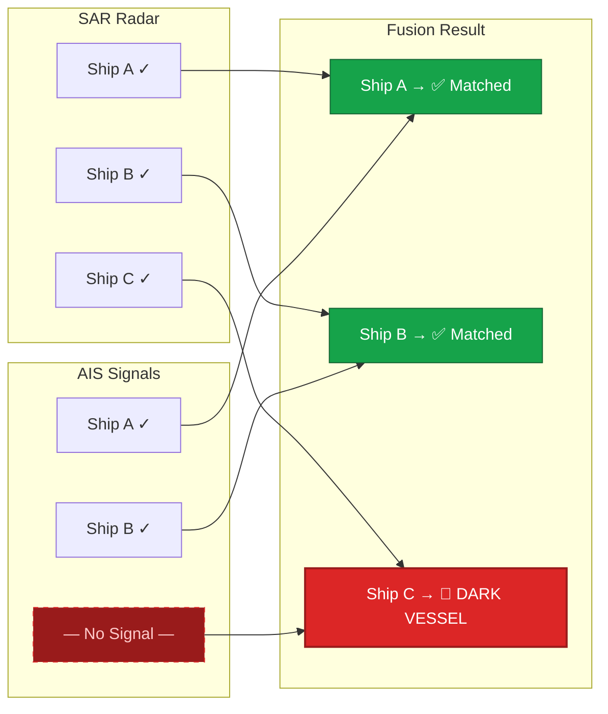

<p align="center">
  <h1 align="center">🛰️ GMIE — Global Maritime Intelligence Engine</h1>
  <p align="center">
    <strong>AI-Powered Dark Vessel Detection & Forensic Evidence Pipeline</strong>
  </p>
  <p align="center">
    <em>Detect illegal fishing &amp; AIS-spoofing vessels using SAR satellite imagery, Gemini Vision AI, and court-admissible forensic hashing.</em>
  </p>
  <p align="center">
    
    
    
    
    
  </p>
</p>

---

## 🎯 Overview

GMIE is an automated maritime surveillance system that fuses **Synthetic Aperture Radar (SAR)** satellite data with **Automatic Identification System (AIS)** ship broadcasts to detect **"Dark Vessels"** — ships operating illegally with their transponders disabled.

The system produces **evidence-grade forensic reports** with SHA-256 integrity hashes and RFC 3161 timestamps, suitable for port authority enforcement and legal proceedings.

### Key Features

- 🛰️ **SAR Image Ingestion** — Reads real satellite radar imagery from the `data/` folder
- 📻 **AIS Signal Simulation** — Generates realistic ship broadcast data for testing
- 🤖 **Gemini Vision AI** — Analyzes SAR images to detect vessel signatures (white dots)
- ⚡ **Radar ↔ AIS Fusion** — Cross-references radar hits against AIS signals to find dark vessels
- 🔐 **SHA-256 Evidence Hashing** — Tamper-proof digital fingerprint for legal admissibility
- ⏱️ **IST Legal Timestamps** — Internet-verified time-seals from worldtimeapi.org
- 📋 **Forensic Markdown Reports** — Court-ready incident reports with all 6 legal sections
- 🌐 **Streamlit Dashboard** — Interactive web UI with model selection and live pipeline visualization

---

## 🏗️ System Architecture

```mermaid
graph TB
    subgraph "🌐 Streamlit Frontend"
        UI["🖥️ Web Dashboard<br/><i>app.py</i>"]
        CFG_UI["🔑 API Key Input<br/>🤖 Model Selector<br/>🛰️ Image Selector"]
    end

    subgraph "📡 Data Ingestion Layer"
        SAR["🛰️ SAR Satellite Image<br/><i>sar_fetch.py</i>"]
        AIS["📻 AIS Ship Signals<br/><i>ais_stream.py</i>"]
    end

    subgraph "🤖 AI Analysis Layer"
        DET["🔍 Gemini Vision Detector<br/><i>detector.py</i>"]
        FUS["⚡ Radar ↔ AIS Fusion<br/><i>fusion.py</i>"]
    end

    subgraph "🔒 Forensic Layer"
        HASH["🔐 SHA-256 Evidence Hash<br/><i>hasher.py</i>"]
        TIME["⏱️ IST Legal Timestamp<br/><i>timestamp.py</i>"]
    end

    subgraph "📄 Reporting Layer"
        RPT["📋 Incident Report<br/><i>pdf_gen.py</i>"]
    end

    subgraph "⚙️ Configuration"
        CFG["📁 config/settings.py<br/><i>Paths, zones, keys</i>"]
        ENV["🔑 .env<br/><i>GEMINI_API_KEY</i>"]
    end

    subgraph "💾 Storage"
        DATA["🖼️ data/<br/><i>SAR JPEG images</i>"]
        REPORTS["📂 reports/<br/><i>Generated .md files</i>"]
    end

    CFG_UI --> UI
    UI --> SAR
    UI --> AIS
    SAR --> DET
    AIS --> FUS
    DET --> FUS
    FUS --> HASH
    HASH --> TIME
    TIME --> RPT
    SAR -.->|"Image embedded"| RPT
    RPT --> REPORTS

    CFG --> UI
    ENV -.-> CFG
    DATA --> SAR

    style UI fill:#1a1a2e,stroke:#e94560,color:#fff,stroke-width:2px
    style FUS fill:#0f3460,stroke:#e94560,color:#fff,stroke-width:2px
    style DET fill:#0f3460,stroke:#60a5fa,color:#fff,stroke-width:2px
    style HASH fill:#16213e,stroke:#34d399,color:#fff
    style TIME fill:#16213e,stroke:#34d399,color:#fff
    style RPT fill:#533483,stroke:#e94560,color:#fff,stroke-width:2px
```



---

## 🔄 Pipeline Workflow

The pipeline executes 6 sequential steps, each visible in the Streamlit UI with real-time progress:

```mermaid
sequenceDiagram
    actor User as 👤 User
    participant UI as 🖥️ Streamlit UI
    participant SAR as 🛰️ SAR Fetch
    participant AIS as 📻 AIS Stream
    participant AI as 🤖 Gemini AI
    participant Fuse as ⚡ Fusion Engine
    participant Hash as 🔐 Hasher
    participant Time as ⏱️ Timestamp
    participant Report as 📋 Report Gen

    User->>UI: Enter API key + Select model
    User->>UI: Click "Run Detection Pipeline"

    rect rgb(15, 12, 41)
        Note over UI,AIS: STEP 1 — The "Stakeout"
        UI->>SAR: Fetch satellite image
        SAR-->>UI: SAR image + lat/lon/date
        UI->>AIS: Collect ship signals
        AIS-->>UI: AIS pings (ship_id, coords, time)
    end

    rect rgb(15, 52, 96)
        Note over UI,AI: STEP 2 — The "Identification"
        UI->>AI: Analyze SAR image with Gemini Vision
        AI-->>UI: Detected vessels (type, size, confidence)
    end

    rect rgb(26, 26, 46)
        Note over UI,Fuse: STEP 3 — Dark Vessel Detection
        UI->>Fuse: Compare radar detections vs AIS signals
        Fuse-->>UI: Dark vessel list (radar hit, no AIS match)
    end

    rect rgb(22, 33, 62)
        Note over UI,Hash: STEP 4 — The "Legal Lock"
        UI->>Hash: Hash image + detection data
        Hash-->>UI: SHA-256 evidence fingerprint
    end

    rect rgb(83, 52, 131)
        Note over UI,Time: STEP 5 — Time-Seal
        UI->>Time: Fetch verified IST timestamp
        Time-->>UI: RFC 3161 timestamp
    end

    rect rgb(185, 28, 28)
        Note over UI,Report: STEP 6 — Incident Report
        UI->>Report: Generate forensic Markdown report
        Report-->>UI: GMIE-2026-XXXXX.md
    end

    UI-->>User: Display results + Download report
```



---

## 🔬 Dark Vessel Detection — How It Works



> A **Dark Vessel** is detected by radar (SAR) but has **no matching AIS signal** — meaning its transponder is disabled, which is illegal in most maritime zones.

---

## 📂 Project Structure

```
GMIE_Project/
├── app.py                  # 🖥️ Streamlit web dashboard & pipeline orchestrator
├── Dockerfile              # 🐳 Container image (Ubuntu 24.04 LTS)
├── .dockerignore           # Docker build exclusions
├── .env                    # 🔑 API keys (GEMINI_API_KEY)
├── .gitignore              # Git exclusions
├── pyproject.toml          # Project metadata
├── requirements.txt        # Dependency list
│
├── config/
│   ├── __init__.py
│   └── settings.py         # ⚙️ Config: API keys, paths, GPS monitoring zone
│
├── src/
│   ├── __init__.py
│   ├── ingestion/
│   │   ├── __init__.py
│   │   ├── ais_stream.py   # 📻 Simulated AIS ship signal generator
│   │   └── sar_fetch.py    # 🛰️ Random SAR image picker + filename parser
│   ├── ai_models/
│   │   ├── __init__.py
│   │   ├── detector.py     # 🤖 Gemini Vision vessel detection (w/ fallback)
│   │   └── fusion.py       # ⚡ Radar vs. AIS comparison → dark vessel ID
│   ├── forensics/
│   │   ├── __init__.py
│   │   ├── hasher.py       # 🔐 SHA-256 evidence fingerprinting
│   │   └── timestamp.py    # ⏱️ IST from worldtimeapi.org
│   └── reporting/
│       ├── __init__.py
│       └── pdf_gen.py      # 📋 Markdown forensic report generator
│
├── data/                   # 🖼️ SAR satellite images (JPEG)
│   ├── 11.26284N_66.40861W_2026-02-20.jpeg
│   ├── 16.49669N_69.44603W_2026-02-17.jpeg
│   └── 16.53534N_69.42185W_2026-02-17.jpeg
│
└── reports/                # 📄 Generated incident reports (.md)
```

---

## 🚀 Quick Start

### Option A: Run Locally

```bash
# 1. Clone the repository
git clone https://github.com/aadarshpandey/GMIE_Project.git
cd GMIE_Project

# 2. Create and activate virtual environment
python3 -m venv .venv
source .venv/bin/activate

# 3. Install dependencies with uv
pip install uv
uv pip install python-dotenv google-generativeai google-genai requests Pillow streamlit

# 4. (Optional) Set your Gemini API key
echo "GEMINI_API_KEY=your_key_here" > .env

# 5. Launch the dashboard
streamlit run app.py
```

### Option B: Run with Docker

```bash
# Pull from Docker Hub
docker pull aadarshpandey/atlantis

# Run the container
docker run -d -p 8501:8501 --name atlantis aadarshpandey/atlantis

# Open in browser
# http://localhost:8501
```

> **Note:** The pipeline works without a Gemini key (uses simulated detections). For real AI analysis, enter your key in the sidebar. Get one free from [Google AI Studio](https://aistudio.google.com/apikey).

---

## 🐳 Docker

### Build Locally

```bash
docker build -t aadarshpandey/gmie:latest .
```

### Push to Docker Hub

```bash
docker login
docker push aadarshpandey/gmie:latest
```

### Run

```bash
docker run -d \
  -p 8501:8501 \
  --name gmie \
  aadarshpandey/gmie:latest
```

Visit **http://localhost:8501** to access the dashboard.

---

## 🤖 Supported Gemini Models

All models support image analysis. Select from the sidebar dropdown:

| Model                            | Speed      | Accuracy | Best For                |
| -------------------------------- | ---------- | -------- | ----------------------- |
| `gemini-2.0-flash`               | ⚡ Fast     | Good     | Default, quick analysis |
| `gemini-2.0-flash-lite`          | ⚡⚡ Fastest | Basic    | Rapid prototyping       |
| `gemini-1.5-flash`               | ⚡ Fast     | Good     | Stable, production use  |
| `gemini-1.5-pro`                 | 🐢 Slower   | ⭐ Best   | Detailed analysis       |
| `gemini-2.5-flash-preview-05-20` | ⚡ Fast     | ⭐ Great  | Latest preview          |
| `gemini-2.5-pro-preview-05-06`   | 🐢 Slower   | ⭐⭐ Best  | Maximum accuracy        |

---

## 🖼️ SAR Image Naming Convention

Images in `data/` follow this format:

```
[Latitude][N/S]_[Longitude][E/W]_[YYYY-MM-DD].jpeg
```

**Example:** `11.26284N_66.40861W_2026-02-20.jpeg`

| Component | Example      | Meaning          |
| --------- | ------------ | ---------------- |
| Latitude  | `11.26284N`  | 11.26284° North  |
| Longitude | `66.40861W`  | 66.40861° West   |
| Date      | `2026-02-20` | Acquisition date |

---

## 📋 Report Format

The generated report follows a **6-section forensic template**:

| #   | Section                   | Purpose                                                     |
| --- | ------------------------- | ----------------------------------------------------------- |
| 1   | **Executive Summary**     | Incident type, location, confidence score, detection counts |
| 2   | **Vessel Identification** | AIS status vs. physical radar detection per vessel          |
| 3   | **Technical Analysis**    | Violation type, behavioral anomaly, engine signature        |
| 4   | **Visual Evidence**       | Embedded SAR image with annotations                         |
| 5   | **Forensic Validation**   | SHA-256 hashes, RFC 3161 timestamp, blockchain TX-ID        |
| 6   | **Enforcement Action**    | Legal basis (UNCLOS Art. 73), recommended response          |

---

## 🛠️ Tech Stack

| Component            | Technology                           |
| -------------------- | ------------------------------------ |
| **Language**         | Python 3.12                          |
| **Frontend**         | Streamlit 1.54                       |
| **AI Engine**        | Google Gemini 2.0 Flash (Vision API) |
| **Hashing**          | SHA-256 (hashlib, stdlib)            |
| **Timestamping**     | worldtimeapi.org / IST (UTC+05:30)   |
| **Image Processing** | Pillow (PIL)                         |
| **Config**           | python-dotenv                        |
| **Package Manager**  | uv                                   |
| **Container**        | Docker (Ubuntu 24.04 LTS)            |
| **Registry**         | Docker Hub                           |

---

## 📜 License

This project is licensed under the MIT License — see the LICENSE file for details.
